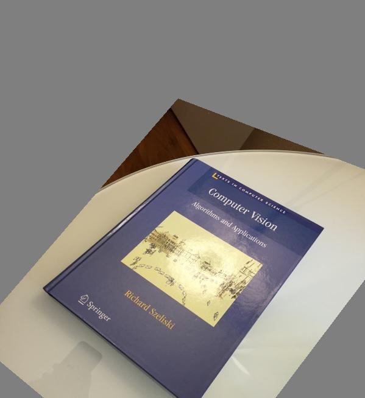
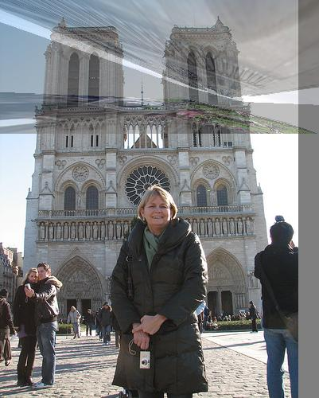
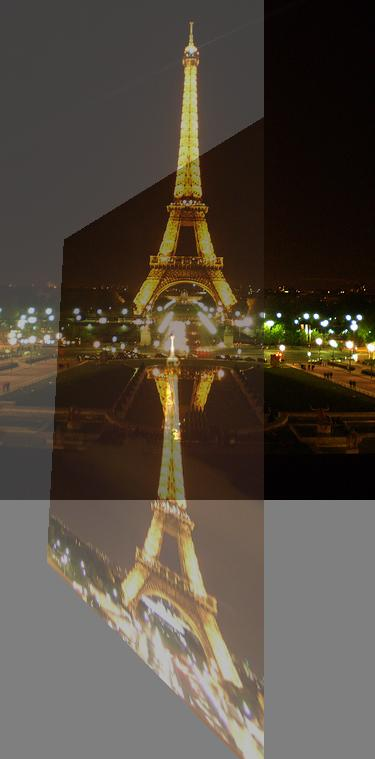
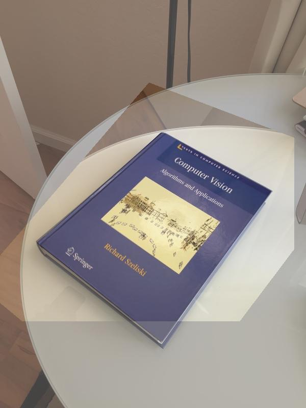
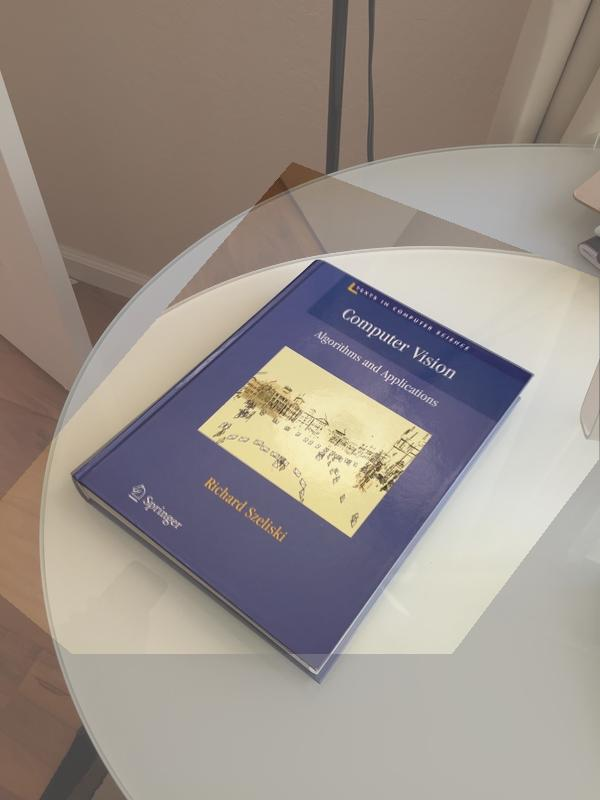

  

# B457 Assignment 2 Group 9

### Running

Our code lumps all three parts into a2.py

The first argument specifies which part (eg. part1) and any further args are as detailed in the assignment document

Example for part 2 
`python a2.py part2 4 book1.jpg book2.jpg output.jpg 318,256 141,131 534,372 480,159 316,670 493,630 73,473 64,601`

### Dependencies

The dependencies for our project are:
* OpenCV
* Pillow
* scikit-image
* scikit-learn
* matplotlib
* NumPy


## Part 1

  

The goal of part 1 was to implement the SIFT algorithm, allowing for clustering an arbitrary number of images into an arbitrary number of groups. This works perfectly well for most images (in testing), however there are some images that do not correctly pass through the SIFT algorithm and result in an error. A couple of these known images are louvre_3.jpg, and louvre_16.jpg, although there are more (at least one bigben jpg also gives this issue). It is still unclear why this occurs.

  

There were some assumptions and heuristic decisions made when implementing the SIFT algorithm. The default number of octaves used for the algorithm was four, however in testing it appeared that very few (and sometimes zero, which would throw an error) keypoints would be present in the images at higher octaves/higher blur. This number was cut to two octaves. However, for the purpose of comparing keypoints, only the keypoints from octave #1 were used. Further strategic implementation could see comparison for keypoints from each octave, but only considering one has worked sufficiently.

  

The method of comparing images for the purpose of clustering was by summing the values of each index for each 128 dimensional feature vector. Admittedly, this seems like an unwise choice, as this means images that produce more keypoints and thus more feature vectors will inherently have higher values in these sums than images that produce fewer vectors. Testing was also performed using the average instead of the sum, but this actually performed worse.

  

**Here is one sample grouping as requested by the assignment:**

  

For 5 groups:

```
part1-images/louvre_4.jpg part1-images/notredame_4.jpg

part1-images/sanmarco_1.jpg

part1-images/bigben_7.jpg part1-images/bigben_6.jpg part1-images/notredame_25.jpg part1-images/bigben_3.jpg

part1-images/colosseum_5.jpg part1-images/sanmarco_13.jpg part1-images/notredame_1.jpg part1-images/bigben_2.jpg

part1-images/louvre_8.jpg
```

This results in an accuracy of 72%. We can see that three of the four bigben images are in the same group, however all of the notredame images (3) are in separate groups.
  

One potential source of error is the method by which the images are clustered, as previously explained. It does not seem like a good clustering technique, however performed better in testing than averaging each vector (such a trial on this dataset gave 59% accuracy as opposed to 72%).

  

Another potential source of error could be the parameters by which the SIFT algorithm is operating. In some trials within the IDE where images would be output with their feature points marked, it was unclear how some points were being designated as features, and how others may not have been. There are many such hyperparameters for the SIFT algorithm, and not many were tested. Despite this, the accuracy is still fairly respectable. Potential improvements for this would be firstly debugging to make sure this algorithm runs on all images, and then trying to improve accuracy by tuning the hyperparameters and/or clustering heuristics + algorithms.

  

## Part 2

  

### Part 2.1

  

We initially implemented part 2.1 with forward warping in the `transform()` and `reconstruct_2D()` functions but quickly found that it produces lots of holes on most transforms. When switching to inverse warping, we had to figure out what the best image dimensions for the warped image were in order to get a good result. Our method takes the corners of the original image and forward warp them, taking the maximum indexes of the result as the dimensions for the warped image. This produces images that are very similar, but not quite identical to the examples in the assignment pdf. Our inverse warping uses basic bilinear interpolation which produces warped images that look good enough for the purpose of this assignment. Here is the result of warping `lincoln.jpg` with the transformation matrix in the assignment:


<p  align="center">


 
</p>
  

### Part 2.2

  

This part of the assignment had very few choices to make as calculating the transformations is based on known systems of equations. This is our version of warping the book2 image like in the assigment.


<p  align="center">


 
</p>

  

## Part 3

  

The challenges we faced in part 3 are mostly a result of the challenges from part 1. Calculating which pairs of SIFT features were correspondences is computationally expensive and often gives unreliable matches, and if there are too many outliers from SIFT there is little RANSAC can do to find a good transformation. We found that the average L<sub>2</sub>-distance between the SIFT features and where the calculated transform predicts they should be is approximately 75, which means most points are outliers.

  

The RANSAC algorithm itself is fairly simple and runs surprisingly fast which gives the option of using very large values for N which can increase its accuracy. Though the bottleneck is actually in how many correspondences SIFT can find and how good they actually are. Here are two of the "best" results results we got from SIFT + RANSAC


<p  align="center">





</p>


 We have a test function for RANSAC `test_ransac()` that takes points from a known transformation, changes them slightly, and reconstructs the transformation from the altered points. It works fairly well on the artificial data and we think it serves as a proof of concept for our RANSAC algorithm

  

<p  align="center">





</p>

  

Here is a comparison between `test_ransac()` (left) and the image produced by part 2. It’s worth noting that this is a cherry-picked example and most of the time RANSAC doesn’t give a result this good but since it is so fast, one option would be to run it many times and choose the best looking image manually.

  

This comparison also demonstrates our image blending method which simply averages the two images. The fill value we used for warped images was (127, 127, 127) instead of pure black which makes the blended image a bit lighter and more recognizable when only one image has real values.

